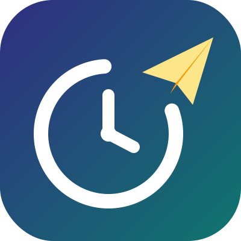
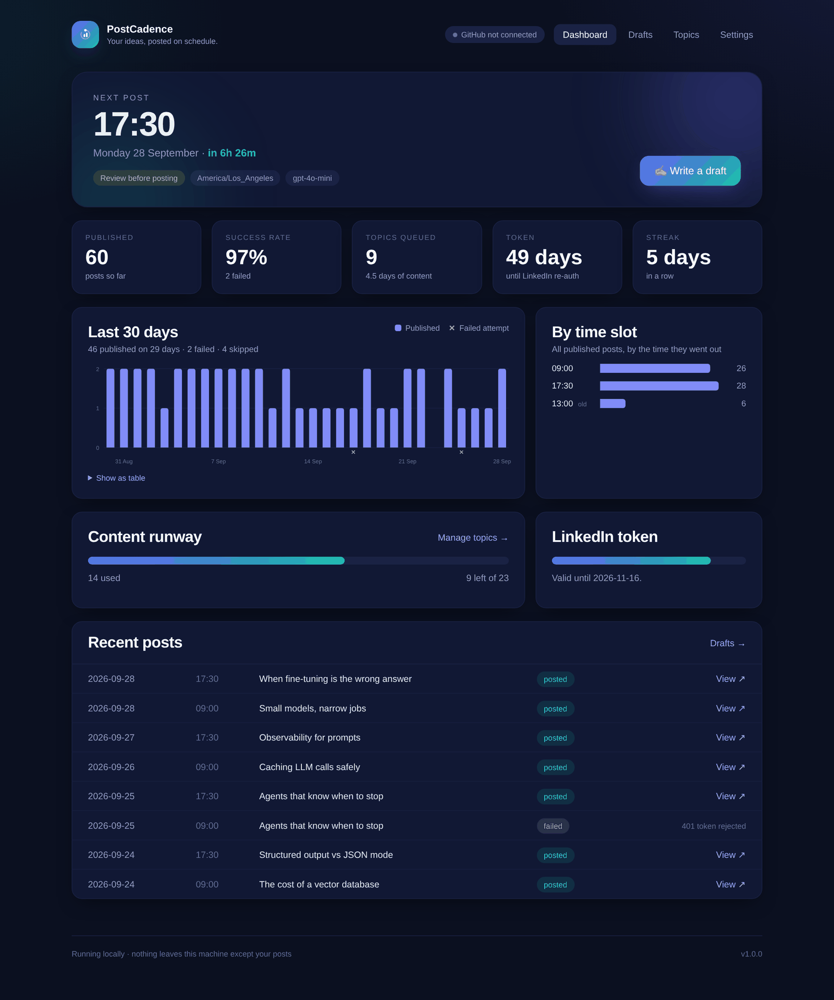
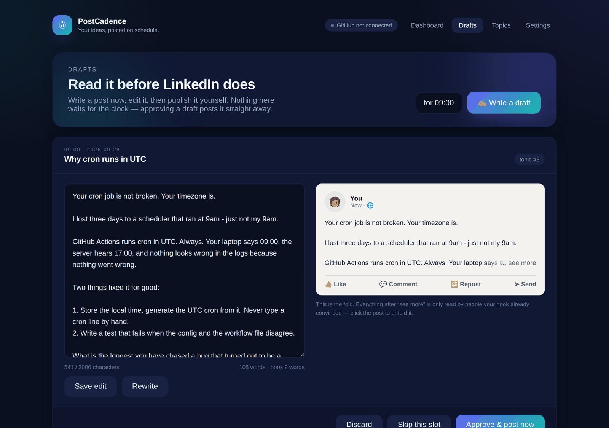
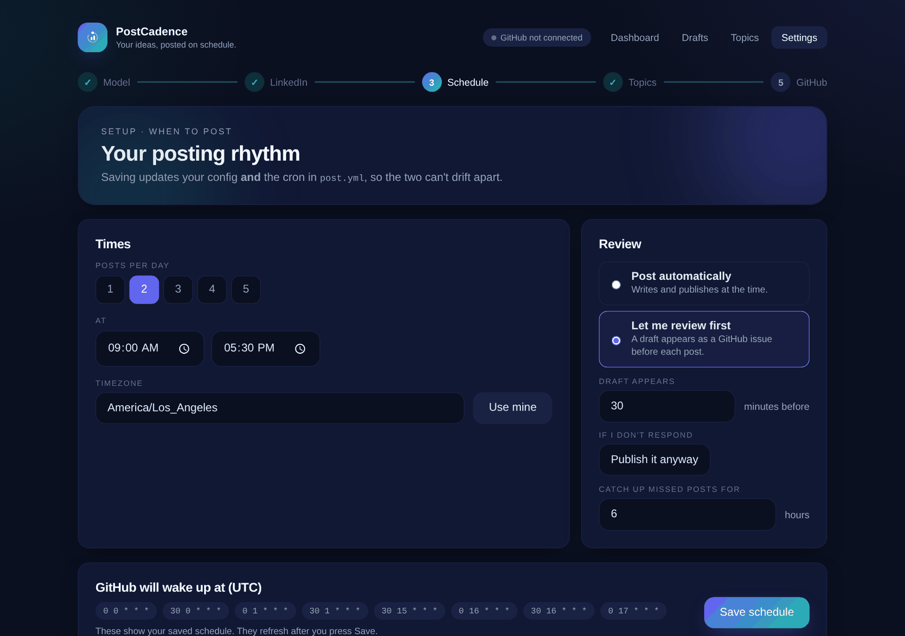
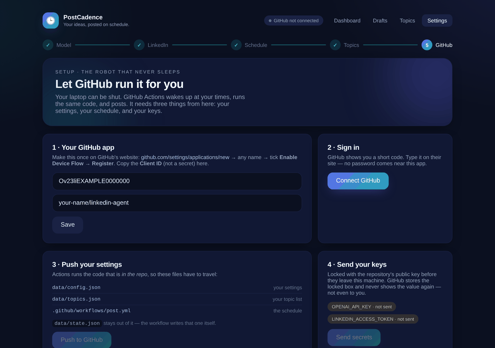
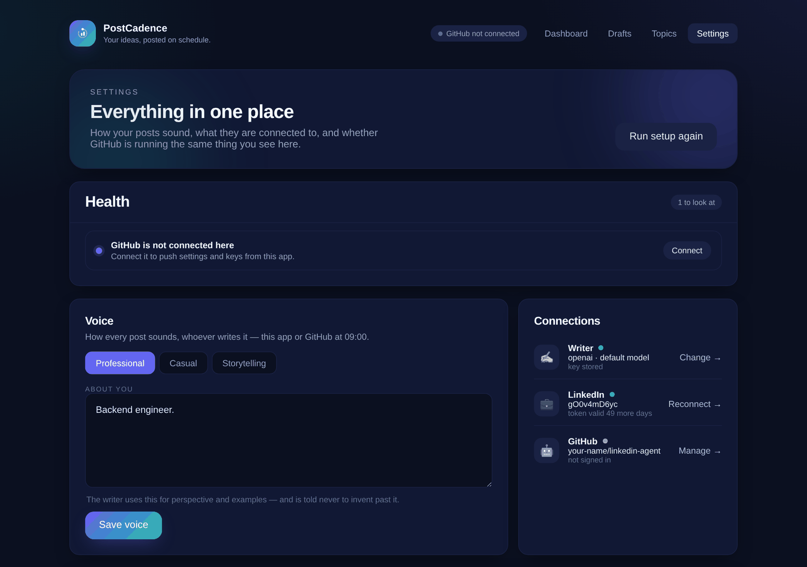
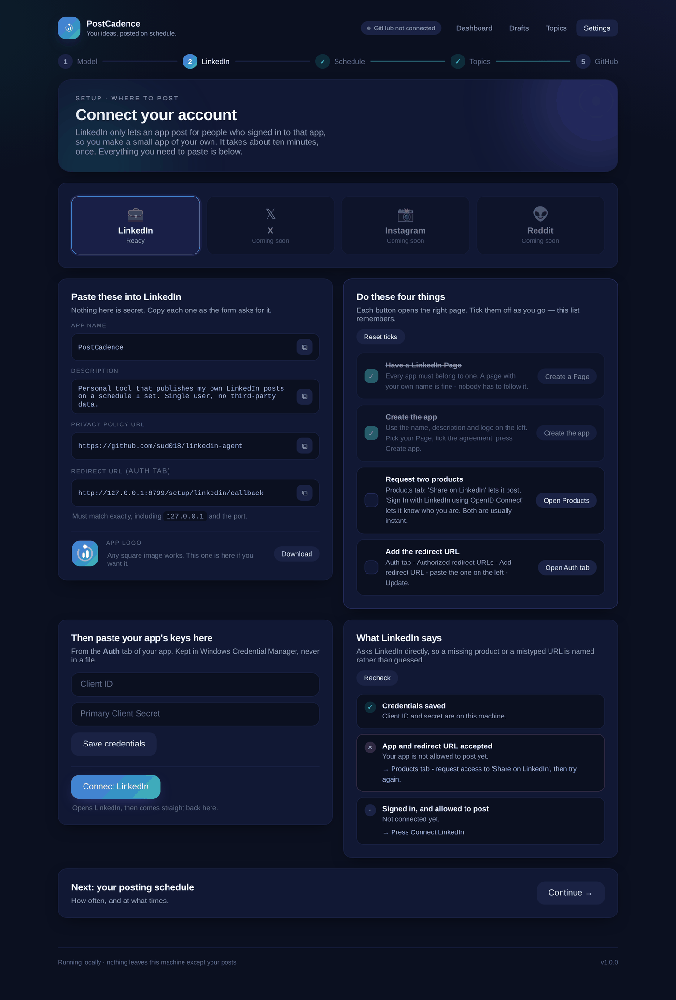

<p align="center">
  
</p>

<h1 align="center">PostCadence</h1>
<p align="center"><em>Your ideas, posted on schedule.</em></p>

Give it a list of topics. A language model of your choice writes a LinkedIn post
for each one, and PostCadence publishes them at the times you pick, with your
laptop closed. Everything is set up from a local web app. You never have to
type a git command or a cron line.



```
topic  ->  model writes  ->  formatter cleans  ->  (you approve)  ->  LinkedIn  ->  history
```

## What it does

- **Writes in your voice.** Choose OpenAI, Anthropic, Gemini or a local Ollama
  model, a tone, and a short note about yourself. The model is told never to
  invent experience beyond that note.
- **Posts on a schedule.** 1–5 posts a day, in your own timezone. GitHub Actions
  does the posting, so your PC can be off.
- **Topics from anywhere.** Type them, or drop in an Excel, Word, PDF, CSV or
  text file. When the list runs out, it revisits yesterday's topic from a
  new angle instead of stopping.
- **Review first if you want.** Write a draft, edit it next to a LinkedIn-style
  preview, then publish, skip or discard it. On GitHub, preview mode opens each
  draft as an issue you approve from your phone.
- **Tells you before something breaks.** The dashboard warns you about expiring
  tokens, a schedule that has drifted from the workflow, a topic list that is
  running out, and settings you have not pushed to GitHub yet.

| Drafts | Schedule |
|---|---|
|  |  |
| **GitHub setup** | **Settings** |
|  |  |

---

## Quick start (Windows)

1. Install **Python 3.10 or newer** from [python.org](https://www.python.org/downloads/).
   Tick **Add python.exe to PATH** during the install.
2. Get the code. The easiest way is to **Fork** this repository on GitHub (top
   right), then **Code → Download ZIP** and unzip it somewhere like `C:\dev\linkedin-agent`.
   If you use git, `git clone` your fork instead.
3. Double-click **`PostCadence.bat`**.

The first run creates a private Python environment in `.venv` and installs
everything, which takes a minute or two. After that it opens
`http://127.0.0.1:8787` in your browser. Follow the five setup steps. The
guides below cover the two steps that happen on other websites.

<details>
<summary>macOS, Linux, or doing it by hand</summary>

```bash
python3 -m venv .venv
source .venv/bin/activate            # Windows: .\.venv\Scripts\Activate.ps1
pip install -e ".[dev]"
python -m web                        # or: postcadence-web
```

</details>

> **Why your own copy?** GitHub Actions runs the code in *your* repository,
> using *your* secrets. Nobody else's keys are involved, and nobody else can
> post as you.
>
> **Want your topics and post history private?** A fork of a public repository
> is always public. Use **Use this template → Create a new repository → Private**
> instead of Fork (or [import it](https://github.com/new/import) as a private
> repository). Everything else in this guide is the same.

---

## The five setup steps

| Step | Where | Time |
|---|---|---|
| 1. Writer | this app: pick a model, paste its key | 1 min |
| 2. LinkedIn | [create a LinkedIn app](#guide-your-linkedin-app) once, then sign in | 10 min, once |
| 3. Schedule | this app: how many posts, what times, auto or preview | 1 min |
| 4. Topics | this app: type them or upload a file | 2 min |
| 5. GitHub | [create a GitHub OAuth app](#guide-your-github-oauth-app) once, then sign in | 5 min, once |

Keys and tokens are kept in **Windows Credential Manager** (the Keychain on
macOS), never in a file. The settings in `data/config.json` hold nothing secret.

### Where to get a model key

| Provider | Get a key at | Notes |
|---|---|---|
| OpenAI | [platform.openai.com/api-keys](https://platform.openai.com/api-keys) | needs a little prepaid credit |
| Anthropic | [console.anthropic.com](https://console.anthropic.com/) → API Keys | |
| Gemini | [aistudio.google.com/apikey](https://aistudio.google.com/apikey) | has a free tier |
| Ollama | no key: install [ollama.com](https://ollama.com) and pull a model | local only, so GitHub cannot use it |

The app checks the key and lists the models it can use. You don't have to type
a model name.

---

## Guide: your LinkedIn app

LinkedIn only lets apps post for people who signed in to them. So you create a
small app of your own. Only you will ever sign in to it.

**The app walks you through this.** Open **Setup → LinkedIn** and work down the
page: the left card has every value to paste (app name, description, privacy
policy URL, redirect URL, and the logo), the right card has four buttons that
open the right LinkedIn pages in order, and **Recheck** asks LinkedIn what is
still missing — a product you have not requested, or a redirect URL that does
not match — instead of leaving you to find out at 09:00. The steps below are
the same thing in writing.



1. **You need a LinkedIn Page.** Every app has to belong to one. If you don't
   have one, go to [linkedin.com/company/setup/new](https://www.linkedin.com/company/setup/new/)
   and make a simple page with your name. Nobody needs to follow it.
2. Open [linkedin.com/developers/apps](https://www.linkedin.com/developers/apps)
   and press **Create app**.
   - **App name:** anything, for example `PostCadence for <your name>`
   - **LinkedIn Page:** the page from step 1
   - **App logo:** any square image (`web/static/img/logo.png` works)
   - Tick the legal agreement, then press **Create app**.
3. Open the **Products** tab and press **Request access** on both of these:
   - **Share on LinkedIn**, which lets the app post as you
   - **Sign In with LinkedIn using OpenID Connect**, which lets the app know who you are

   Both are usually approved straight away. Refresh the page if they still say *pending*.
4. Open the **Auth** tab.
   - Under **Authorized redirect URLs for your app**, press **Add redirect URL** and paste:
     ```
     http://127.0.0.1:8787/setup/linkedin/callback
     ```
     Then press **Update**. It must match *exactly*, including `127.0.0.1` (not
     `localhost`) and the port.
   - Copy the **Client ID** and the **Primary Client Secret**.
5. Back in PostCadence, go to **Setup → LinkedIn**. Paste both values, press
   **Save credentials**, then **Connect LinkedIn**.

**The token lasts 60 days.** The dashboard warns you a week before it expires,
and `token.yml` opens a GitHub issue two weeks before. To renew, press
**Reconnect** in Settings, then **Send secrets** on the GitHub page.

<details>
<summary>Changing the port</summary>

The port is fixed at 8787 on purpose. LinkedIn rejects any redirect that is not
an exact match. If 8787 is taken on your machine, change `PORT` in
`web/__main__.py` and add the matching callback URL to your LinkedIn app. The
app prints the exact URL when it starts.

</details>

---

## Guide: your GitHub OAuth app

This lets PostCadence push your settings and store your keys in your fork, from
the browser. It uses GitHub's *device flow*: you type a short code on github.com,
and your password never comes near this app.

1. Open [github.com/settings/applications/new](https://github.com/settings/applications/new).
   - **Application name:** `PostCadence`
   - **Homepage URL:** `http://127.0.0.1:8787`
   - **Authorization callback URL:** `http://127.0.0.1:8787`. The device flow
     never uses it, but GitHub requires a value.
   - Tick **Enable Device Flow**. This one matters.
   - Press **Register application**.
2. Copy the **Client ID**. You do **not** need a client secret. The Client ID
   isn't secret, so it is stored in `data/config.json`.
3. In PostCadence, go to **Setup → GitHub**. Paste the Client ID. The repository
   is filled in from your git remote; check it says `your-name/linkedin-agent`.
   Press **Save**.
4. Press **Connect GitHub**. A code appears and github.com opens. Type the code
   and approve.
5. Press **Push to GitHub**, then **Send secrets**.
6. On github.com, open your fork, then **Actions**, and enable workflows if
   GitHub asks you to. Forks start with them switched off.
7. Test it: **Actions → Post to LinkedIn → Run workflow**, leaving *dry run*
   ticked. The log should end with a written post and nothing published.

From now on, the **sync badge** in the top bar tells you when something you
changed here hasn't reached GitHub yet.

---

## How it works

The code is in four layers. Each layer only calls the one below it.

| Layer | What lives there | Examples |
|---|---|---|
| **Interface** | ways in: browser, terminal, scheduler | `web/`, `agent/cli/`, `.github/workflows/` |
| **Decision** | what should happen now | `agent/schedule.py`, `agent/topics/picker.py`, `agent/run.py` |
| **Capability** | talking to the outside world | `agent/llm/`, `agent/linkedin/`, `agent/github/`, `agent/writer.py`, `agent/formatter.py` |
| **Data** | what is remembered | `agent/config.py`, `agent/state.py`, `agent/topics/store.py`, `agent/drafts.py` |

A few decisions worth knowing about:

- **Cron runs in UTC and has no idea about daylight saving.** The schedule page
  writes one cron line per slot per UTC offset into `post.yml`. Wake-ups that
  aren't due exit within seconds. A test fails if `config.json` and `post.yml`
  ever disagree.
- **Each file has one owner.** You change `config.json`, `topics.json` and
  `post.yml` here, and they flow *up* to GitHub. The workflow writes
  `state.json` after every post, and it flows *down* here. Neither side
  overwrites the other's file.
- **Secrets are sealed before they leave your machine.** Each value is
  encrypted with the repository's public key (a libsodium sealed box), and only
  the locked box is sent.
- **The topic bookmark only moves when a post goes out.** Writing, rewriting or
  discarding a draft never uses up a topic.

### Settings (`data/config.json`)

| Key | Meaning |
|---|---|
| `llm_provider` / `llm_model` | `openai`, `anthropic`, `gemini`, `ollama`; blank model = the provider's default |
| `timezone` | IANA name, for example `America/Los_Angeles` |
| `posts_per_day` / `post_times` | how many posts, and at what local times |
| `tone` | `professional`, `casual`, `storytelling` |
| `author_context` | facts about you that the model may draw on |
| `mode` | `auto` posts directly; `preview` opens a draft issue first |
| `preview_minutes` / `preview_timeout_action` | how early the draft appears, and `post` or `skip` if you don't respond |
| `catch_up_hours` | how long after a missed slot it may still post |
| `github_client_id` / `github_repo` | your OAuth app and fork (neither is secret) |

### Workflows

| File | Runs | Does |
|---|---|---|
| `post.yml` | your schedule, or manually | writes and publishes, then commits `state.json` back |
| `ci.yml` | every push and pull request | ruff and pytest on Python 3.10–3.12 |
| `token.yml` | Mondays | opens an issue when the LinkedIn token is close to expiring |

---

## Troubleshooting

| You see | It means | Do this |
|---|---|---|
| LinkedIn: *redirect_uri does not match* | the callback URL in your LinkedIn app is not exactly the one the app uses | copy it from Setup → LinkedIn and paste it on the Auth tab |
| LinkedIn: *401* when posting | the token expired or was revoked | Settings → Reconnect, then Send secrets |
| LinkedIn: *426 NONEXISTENT_VERSION* | the API version in `agent/linkedin/poster.py` has retired (they last about a year) | bump `LINKEDIN_VERSION` to a recent `YYYYMM` |
| GitHub: *This OAuth app does not have device flow switched on* | the checkbox was missed | tick **Enable Device Flow** in the OAuth app settings |
| Actions didn't run at your time | GitHub can start scheduled runs 5–20 minutes late at busy times | expected; `catch_up_hours` covers it |
| *Port 8787 is already in use* | another PostCadence window is still open | close it, or see *Changing the port* |
| Sync badge: *N new runs on GitHub* | GitHub has posted since you last looked | Settings → Pull post history |

---

## Command line

Everything in the app also works from a terminal. Scheduled runs use the terminal commands.

| Command | Does |
|---|---|
| `python -m web` / `postcadence-web` | the local app |
| `python -m agent status` | next run, topics left, recent posts, token expiry |
| `python -m agent run [--dry-run] [--slot HH:MM] [--force]` | one post |
| `python -m agent run-due [--dry-run]` | whatever is due now (what the scheduler calls) |
| `python -m agent topics add --file F \| --text "a; b"` | add topics |
| `python -m agent linkedin connect \| test-post` | sign in, or post a one-off |
| `python -m agent check-llm` | check that the model key works |
| `python -m agent secret set \| delete \| push` | manage credentials |
| `python -m agent cron` | cron lines for the current schedule |

## Development

```bash
pip install -e ".[dev]"
python -m pytest          # no test touches the network, LinkedIn, GitHub or your real data
ruff check .
```

`tests/conftest.py` points every data file at a temporary folder and clears
secret environment variables before each test. Keep it at the top of `tests/`,
so it guards every test.

See [CHANGELOG.md](CHANGELOG.md) for what changed in each version.
